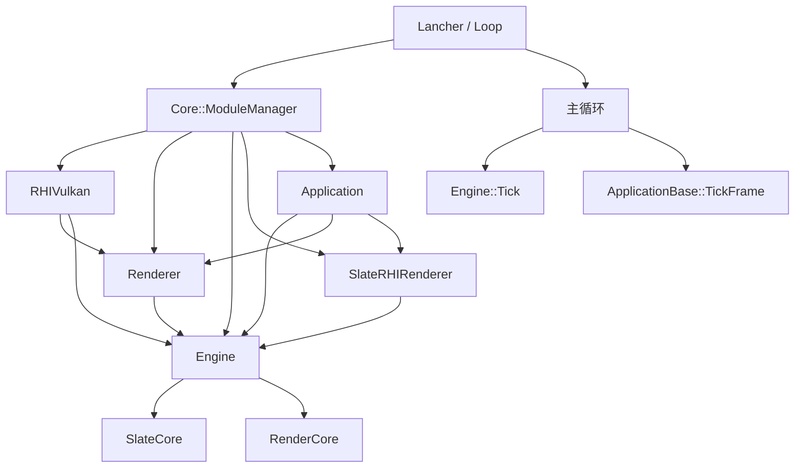

# 项目整体架构说明

## 1. 总体定位

这个项目采用了“入口程序 + 模块管理器 + 运行时模块”的整体组织方式。`Lancher` 作为应用启动入口，负责按依赖关系加载各个功能模块，并在主循环中驱动引擎与应用逻辑的更新。整体上，项目的结构可以概括为：

- `Lancher` 负责启动和主循环
- `Core::ModuleManager` 负责模块注册、依赖管理与启动顺序
- `Engine` 提供底层运行时能力，如场景、资源、相机等核心功能
- `Renderer / RenderCore / RHIVulkan` 提供渲染和图形接口能力
- `SlateCore / SlateRHIRenderer` 提供窗口、UI 和渲染桥接能力
- `Application` 作为最终业务应用，继承自 `ApplicationBase` 并在帧循环中进行应用级更新

---

## 2. 启动入口：`Lancher`

启动入口在 `src/Lancher/Loop.cpp` 中，核心流程如下：

1. `Loop::Init()` 中依次调用 `ModuleManager::LoadModule(...)` 加载所需模块。
2. 这些模块包括：
   - `RHIVulkan`
   - `Renderer`
   - `Engine`
   - `SlateRHIRenderer`
   - `Application`
3. 接着通过 `AddModuleDependency(...)` 建立模块间依赖关系，保证启动顺序符合依赖约束。
4. 最后调用 `ModuleManager::StartupAll()`，由模块管理器按拓扑顺序启动各模块。

从代码上看，`Loop::Init()` 的职责不是直接初始化各个系统，而是通过统一的模块管理机制来完成初始化，这样可以把模块注册、依赖解析和生命周期管理集中起来。

---

## 3. 模块管理机制：`Core::ModuleManager`

`Core::ModuleManager` 是整个项目中最关键的组织机制之一。它负责：

- 模块注册：`RegisterModule(name, module)`
- 模块依赖声明：`AddModuleDependency(module, dependency)`
- 模块查找：`GetModule(name)`
- 按依赖顺序启动：`StartupAll()`
- 按逆序关闭：`ShutdownAll()`

在模块实现中，通常通过宏 `IMPLEMENT_SIMPLE_MODULE(...)` 进行注册，例如 `EngineModule`、`Application` 等模块会在实现文件中注册到全局模块管理器中。这样可以让 `Lancher` 仅负责装配和启动，不直接依赖具体模块实现。

模块管理器内部使用了拓扑排序来处理依赖关系，确保模块在 `StartupModule()` 之前，依赖模块已经准备完毕。其设计方式与 UE 类似，体现出“模块化、可扩展、依赖解耦”的架构思路。

---

## 4. 主循环：`Tick` 驱动机制

在 `Loop::Run()` 中，应用进入主循环：

```cpp
while (!ApplicationBase::GetApplication()->RequestExit()) {
    float deltaTime = Core::Timer::GetGlobalInstance().GetDelta();
    Engine::GetEngineInstance()->Tick(deltaTime);
    ApplicationBase::GetApplication()->TickFrame();
}
```

这段逻辑体现了当前项目的统一帧驱动方式：

- 引擎在每帧先执行 `Tick(deltaTime)`
- 应用在每帧再执行 `TickFrame()`
- 其中，`deltaTime` 用于控制更新速度和时间推进

因此，当前项目的主循环并不是简单的“单一系统更新”，而是采用了“引擎更新 + 应用更新”的分层推进方式。

---

## 5. 引擎模块与应用模块的职责分层

### 5.1 `Engine` 模块

`Engine` 模块由 `EngineModule` 负责创建和管理，具体实现是：

- `EngineModule::StartupModule()` 中创建 `IEngine`
- 调用 `IEngine->Init()` 完成初始化
- `GetEngineInstance()` 返回当前全局 engine 实例

`Engine` 作为核心运行时层，承担了大部分底层功能，例如：

- 场景与对象管理
- 资源和资产管理
- 视口与摄像机逻辑
- 运行时更新调度

在当前项目中，`Engine` 依赖了 `RHI`、`SlateCore` 以及 `RenderCore` 等能力，因此它既是功能聚合层，也是渲染和平台能力的桥接层。

### 5.2 `ApplicationBase` 与应用派生实现

`SlateCore::ApplicationBase` 是应用层的抽象基类，定义了统一接口：

- `Initialize()`
- `RequestExit()`
- `Shutdown()`
- `TickFrame()`

具体应用通过继承该类来实现，例如：

- `App::Application` 继承自 `SlateCore::ApplicationBase`
- 该类承担窗口、UI、场景视口、编辑器界面等业务能力

此外，`ApplicationBase` 提供了全局单例访问：

- `ApplicationBase::SetApplication(...)`
- `ApplicationBase::GetApplication()`

这样做的好处是，`Lancher` 不需要直接持有具体应用对象，而是通过统一的 `ApplicationBase` 接口访问当前应用实例，增强了程序的扩展性和抽象层次。

---

## 6. 模块之间的依赖关系

当前项目中的典型依赖关系可以概括为：

- `Renderer` 依赖 `RHIVulkan`
- `Engine` 依赖 `RHIVulkan`
- `SlateRHIRenderer` 依赖 `Engine`
- `Application` 依赖 `Engine`
- `Application` 依赖 `Renderer`
- `Application` 依赖 `SlateRHIRenderer`

这说明项目的设计思路是：

- 底层图形和平台能力由 `RHIVulkan` 与 `Renderer` 提供
- 核心逻辑和运行时由 `Engine` 统一组织
- UI/窗口系统由 `SlateCore` 和 `SlateRHIRenderer` 承担
- 最终应用层通过 `Application` 组合这些能力，而不是直接耦合底层实现

---

## 7. 整体架构概览



从架构上看，`Lancher` 是启动和调度中心；`ModuleManager` 是模块装配和依赖组织中心；`Engine` 是核心运行时层；`ApplicationBase` 是业务应用入口；`Renderer / RHI / Slate` 是底层渲染与窗口能力层。它们之间通过依赖和统一的主循环关系组合成完整的应用架构。

---

## 8. 总结

该项目的整体架构特点是：

1. 使用模块化管理机制驱动初始化与关闭。
2. 通过依赖声明保证模块启动顺序。
3. 在主循环中分别执行 `Engine` 和 `Application` 的 `Tick`。
4. `Engine` 统一承接底层功能，而 `ApplicationBase` 负责保存派生应用实例。
5. 采用“底层能力层 + 核心引擎层 + 应用层”的分层设计，便于扩展和维护。

这种结构既保持了模块隔离，也保留了较强的扩展能力，符合现代引擎型项目的典型组织方式。